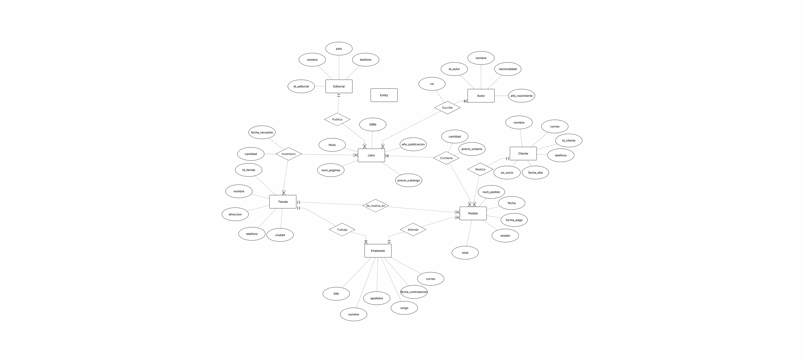

# Base de datos

# Páginas de Villa Serena.

## 1. Resumen del caso

Las paginas de Villa Serena. Es una librería que dispone de tres tiendas, la de Centro, Ribera y Universidad. Ahora mismo la información se lleva en hojas de calculo separadas, por lo cual es más dificil conocer con precision el stock disponible en cada tienda y poder consultar las ventas.
La librería también necesita una base de datos central que permita almacenar las tiendas, libros, editoriales, autores, inventario, empleados, clientes y pedidos. También debe conservar el precio real cobrado en cada linea de pedido, ya que el precio de catálogo cambia con el tiempo.
El sistema tiene que permitir consultar el stock por tienda, analizar las ventas, conocer la facturación, localizar clientes con frecuencia, comparar existencias entre tiendas, saber qué empleados atienden más pedidos y detectar los que aparecen publicados por distintas editoriales.

---

## 2. Analisis del caso

### 2.1 Entidades y atributos

**Tienda**
Atributos: Id, nombre, dirección, telefono y ciudad.
Fragmento del caso: Cada una tiene su nombre, su dirección, su teléfono y su ciudad.

**Libro**
Atributos: ISBN, titulo, año de publicacion, paginas, precio de catalogo y editorial.
Fragmento del caso: Cada libro se identifica por su ISBN, titulo, año de publicación, numero de paginas y precio de catalogo.

**Editorial**
Atributos: Id, nombre, país y telefono de contacto.
Fragmento del caso: De cada editorial anotan su nombre, el país y un telefono de contacto.

**Autor**
Atributos: Id, nombre, nacionalidad y año de nacimiento.
Fragmento del caso:  De cada autor guardamos el nombre, la nacionalidad y el año de nacimiento.

**Inventario**
Atributos: tienda, libro, stock y fecha del ultimo conteo.
Fragmento del caso: Para cada libro y cada tienda sepa cuantas copias hay, y cuando se contó por ultima vez.

**Empleado**
Atributos: DNI, nombre, apellidos, cargo, fecha de contratación, correo y tienda.
Fragmento del caso: De cada empleado trabaja en una sola tienda, y se indican sus datos.

**Cliente**
Atributos: id, nombre completo, email, telefono y fecha de alta.
Fragmento del caso: Datos de socios y clientes registrados.

**Pedido**
Atributos: id, fecha, metodo de pago, estado, tienda, empleado y cliente.
Fragmento del caso: Un pedido se hace siempre en una tienda, lo atiende un empleado y lo compra un cliente.

**Detalle de pedido**
Atributos: pedido, libro, cantidad y precio pagado.
Fragmento del caso: Cada pedido puede llevar varios libros distintos, y se necesita guardar lo realmente cobrado.

**Libro Autor**
Atributos: libro, autor y tipo de autoría.
Fragmento del caso: Un libro puede tener varios autores y se distingue entre principal y colaborador.

### 2.2 Datos descartados

**Total del pedido**
Decision: No se almacena.
Motivo: Se puede calcular sumando cantidad * precio_pagado de sus lineas.

**Telefono de la tienda dentro del pedido**
Decision: No se repite.
Motivo: El pedido ya referencia a la tienda y el telefono pertenece a ella.

**Nombre del empleado dentro del pedido**
Decision: No se repite.
Motivo: Se obtiene con la FK empleado_dni.

**Nombre del cliente dentro del pedido**
Decision: No se repite.
Motivo: Se obtiene xcon la FK cliente_id.

**Stock en una columna del libro**
Decision: No se almacena.
Motivo: El stock depende de cada tienda y se guarda en inventario.

**Precio actual como precio historico del pedido**
Decision: No se utiliza.
Motivo: El precio de catalogo puede cambiar, el pedido conserva precio_pagado.

**Historial de cambios de tienda de un empleado**
Decision: No se almacena.
Motivo: El caso indica expresamente que no interesa conservar ese historial.

---

## 3. Reglas de negocio

1. Una tienda tiene un nombre, una dirección, un telefono y la ciudad.
2. Un libro se identifica mediante el ISBN, tiene 13 cifras.
3. Cada libro pertenece a una unica editorial.
4. Una editorial puede publicar muchos libros.
5. Un libro puede tener varios autores y un autor puede participar en muchos libros.
6. Para cada relación libro autor se debe indicar si el autor es principal o colaborador.
7. El inventario se controla por una combinación de tienda y libro.
8. Si un libro no esta presente en una tienda, no es hace falta crear una fila de inventario para esa combinación.
9. El stock nunca estara en negativo.
10. Cada empleado trabajara en una sola tienda.
11. El cargo de un empleado solo puede ser librero, cajero o encargado.
12. El correo electronico de cada cliente es unico.
13. El telefono del cliente es opcional.
14. Cada pedido pertenece a una unica tienda, lo atiende un unico empleado y pertenece a un unico cliente.
15. El metodo de pago solo puede ser efectivo, tarjeta o bizum.
16. El estado de un pedido solo puede ser preparado, entregado o cancelado.
17. Cada pedido debe tener libros distintos en sus lineas.
18. La cantidad de cada linea debe ser mayor que cero.
19. Cada linea de pedido conserva el precio realmente pagado.
20. El precio pagado no puede estar en negativo.

---

## 4. Diagrama entidad-relación



### Tabla de relaciones

| Relación | Tipo | Cómo se resuelve |
|---|---|---|
| tienda – empleado | 1:N | empleado.tienda_id |
| tienda – inventario | 1:N | inventario.tienda_id |
| libro – inventario | 1:N | inventario.isbn |
| editorial – libro | 1:N | libro.editorial_id |
| libro – autor | N:M | Tabla libro_autor |
| tienda – pedido | 1:N | pedido.tienda_id |
| empleado – pedido | 1:N | pedido.empleado_dni |
| cliente – pedido | 1:N | pedido.cliente_id |
| pedido – libro | N:M | Tabla detalle_pedido |

---

## 5. Modelo lógico

### `tienda`

| Columna | Clave | Referencia |
|---|---|---|
| id | PK | |
| nombre | | |
| direccion | | |
| telefono | | |
| ciudad | | |

### `editorial`

| Columna | Clave | Referencia |
|---|---|---|
| id | PK | |
| nombre | | |
| pais | | |
| telefono_contacto | | |

### `autor`

| Columna | Clave | Referencia |
|---|---|---|
| id | PK | |
| nombre | | |
| nacionalidad | | |
| anio_nacimiento | | |

### `libro`

| Columna | Clave | Referencia |
|---|---|---|
| isbn | PK | |
| titulo | | |
| anio_publicacion | | |
| paginas | | |
| precio_catalogo | | |
| editorial_id | FK | editorial.id |

### `libro_autor`

| Columna | Clave | Referencia |
|---|---|---|
| isbn | PK, FK | libro.isbn |
| autor_id | PK, FK | autor.id |
| tipo_autoria | | |

### `inventario`

| Columna | Clave | Referencia |
|---|---|---|
| tienda_id | PK, FK | tienda.id |
| isbn | PK, FK | libro.isbn |
| stock | | |
| fecha_ultimo_conteo | | |

### `empleado`

| Columna | Clave | Referencia |
|---|---|---|
| dni | PK | |
| nombre | | |
| apellidos | | |
| cargo | | |
| fecha_contratacion | | |
| email_trabajo | | |
| tienda_id | FK | tienda.id |

### `cliente`

| Columna | Clave | Referencia |
|---|---|---|
| id | PK | |
| nombre_completo | | |
| email | | |
| telefono | | |
| fecha_alta | | |

### `pedido`

| Columna | Clave | Referencia |
|---|---|---|
| id | PK | |
| fecha | | |
| metodo_pago | | |
| estado | | |
| tienda_id | FK | tienda.id |
| empleado_dni | FK | empleado.dni |
| cliente_id | FK | cliente.id |

### `detalle_pedido`

| Columna | Clave | Referencia |
|---|---|---|
| pedido_id | PK, FK | pedido.id |
| isbn | PK, FK | libro.isbn |
| cantidad | | |
| precio_pagado | | |

---
## 6. Script SQL (`schema.sql`)

El archivo `schema.sql` contiene la creación de la base de datos, las tablas, restricciones y datos de prueba.

La estructura se crea en orden de dependencia: primero las entidades independientes y después las tablas que contienen claves foráneas.

```sql
CREATE DATABASE IF NOT EXISTS libreria;
USE libreria;
```

El script completo se entrega junto a este documento como `schema.sql`.

---

## 8. Decisiones de diseño

### 8.1 Guardar el precio pagado en `detalle_pedido`

**Que se decidfo=** cada linea de pedido guarda `precio_pagado`.

**Por que=** el precio de catlogo puede cambiar. El caso pone como ejemplo que Ficciones paso de 10 € a 12 €, por lo que un pedido antiguo debe conservar el importe.

**Alternativa descartada=** consultar siempre `libro.precio_catalogo` para calcular el importe del pedido.

### 8.2 Crear `libro_autor`

**Que se decidio:** la relacion entre libros y autores se representa mediante una tabla intermedia.

**Por que=** un libro puede tener dos o tres autores y un autor puede participar en muchos libros. Ademas, la relacion tiene los datos propio `tipo_autoria`.

**Alternativa descartada:** almacenar varios autores en una sola columna de `libro`, por ejemplo `Cortazar / Borges`, porque dificultaria las busquedas y no permitiria distinguir correctamente la autoria.